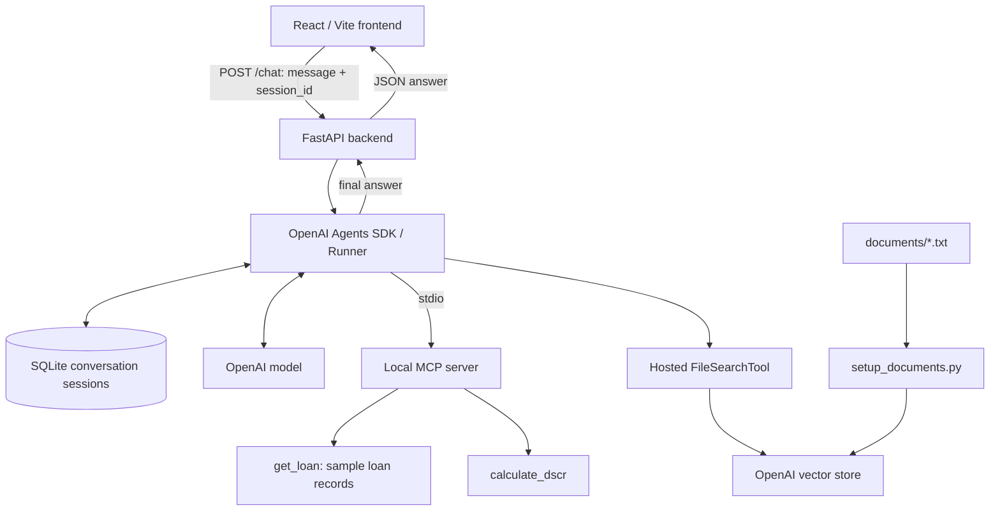

# LoanOps Agent

LoanOps Agent is a commercial loan servicing portfolio project built with the OpenAI Agents SDK, FastAPI, and React. It combines structured loan data, deterministic financial calculations, and retrieval from loan agreement documents to answer operational and contractual questions in a conversational interface.

The project uses three sample loans stored in Python dictionaries and corresponding text agreements. For example, it can retrieve loan 1001’s current financials, calculate its DSCR of **1.25**, and compare that value with the agreement’s minimum of **1.20**.

## Major features

- **Tool-based loan lookup:** Retrieve borrower, property, balance, NOI, annual debt service, and maturity information for loans 1001–1003.
- **Deterministic calculations:** Calculate debt service coverage ratio (DSCR) as NOI divided by annual debt service, rounded to three decimal places, with zero-denominator handling.
- **Document-grounded answers:** Use hosted file search to retrieve contractual requirements such as covenants, insurance, reserves, and reporting obligations.
- **Conversational context:** Store agent conversation history in SQLite sessions for follow-up questions.
- **React chat interface:** Display messages, a pending-response indicator, backend connectivity status, and a Clear Chat control.
- **Quality checks:** Combine mocked API tests with a separate live evaluation harness that grades answers and tool usage.
- **Delivery tooling:** Run API tests through GitHub Actions and package the backend with Docker.

## Architecture and request flow



1. FastAPI starts `mcp_server.py` as a local subprocess through `MCPServerStdio` and creates a reusable agent during application startup.
2. The frontend sends a message and its generated session UUID to `POST /chat`. The API rejects empty or whitespace-only messages with HTTP 422.
3. The backend opens a `SQLiteSession` for that session ID in `web_conversations.db` and invokes `Runner.run`.
4. The agent selects MCP tools for structured data and calculations, or `FileSearchTool` for loan agreement evidence. File search is configured to return at most five results from the configured vector store.
5. The API returns the completed answer as `{"answer": "..."}`, which the frontend adds to the conversation.

### Agent and retrieval

The agent instructions direct it to use tools, distinguish current operational values from contractual requirements, and acknowledge missing evidence. Retrieval-augmented generation (RAG) uses OpenAI-hosted file search over the sample agreements. `setup_documents.py` creates a vector store, uploads `documents/*.txt`, and waits for indexing to complete.

The web agent, MCP CLI agent, and evaluation agent use the same two MCP tools: `get_loan` and `calculate_dscr`. The standalone `agent.py` demonstrates an alternative with directly registered Python tools. Agent constructors do not specify a model; they use the installed SDK’s default configuration.

### Backend, frontend, and sessions

The FastAPI backend exposes:

| Endpoint | Behavior |
| --- | --- |
| `GET /health` | Returns `{"status": "ok"}`. |
| `POST /chat` | Accepts `message` and an optional `session_id` (default: `web_demo`); returns `answer`. |

The React frontend uses Vite and calls `http://127.0.0.1:8000` directly. Backend CORS permits `http://localhost:5173` and `http://127.0.0.1:5173`.

SQLite stores conversation history, while sample loan records remain in Python dictionaries. The web UI keeps its session UUID in React state: reloading the page or selecting **Clear Chat** starts a new session. Clear Chat resets the display and session ID; it does not delete existing database records. The UI does not restore previous conversations after a reload.

| Entry point | Conversation database | Session ID |
| --- | --- | --- |
| `api.py` | `web_conversations.db` | Request-provided ID, or `web_demo` |
| `mcp_agent.py` | `mcp_conversations.db` | `loanops_mcp_demo` |
| `agent.py` | `conversations.db` | `loanops_interview_demo` |

Database paths are relative to the process working directory.

## Project structure

```text
.
├── README.md
├── .env.example                 # Required backend environment variables
├── .github/workflows/tests.yml  # API test workflow
├── .dockerignore
├── Dockerfile                   # Python backend image
├── requirements.txt             # Pinned Python dependencies
├── api.py                       # FastAPI endpoints and agent lifecycle
├── agent.py                     # CLI agent with direct Python tools
├── mcp_agent.py                 # CLI agent with MCP tools
├── mcp_server.py                # Sample loan lookup and DSCR tools
├── setup_documents.py           # Hosted vector store creation and ingestion
├── documents/
│   ├── loan_1001.txt
│   ├── loan_1002.txt
│   └── loan_1003.txt
├── eval_cases.json              # Five evaluation cases and grading criteria
├── eval_runner.py               # Live answer and tool-trajectory evaluation
├── test_search.py               # Live vector-search diagnostic script
├── tests/
│   └── test_api.py              # Isolated API tests
└── frontend/
    ├── package.json             # Vite development, build, lint, preview scripts
    ├── vite.config.js
    ├── index.html
    └── src/
        ├── App.jsx             # Chat UI and API requests
        ├── App.css
        ├── index.css
        └── main.jsx
```

## Local setup

Use Python **3.12** to match CI and Docker, Node.js/npm compatible with the Vite version in `frontend/package.json`, and an OpenAI API key for live agent and retrieval calls. Docker is needed only for the container instructions.

Run the following from the repository root in a POSIX shell such as Bash or Zsh:

```bash
python3.12 -m venv .venv
source .venv/bin/activate
python -m pip install -r requirements.txt
cp -n .env.example .env
```

### Environment variables

Edit `.env` using the keys provided in [`.env.example`](.env.example):

```dotenv
OPENAI_API_KEY=your_openai_api_key
LOANOPS_VECTOR_STORE_ID=your_vector_store_id
```

| Variable | Purpose |
| --- | --- |
| `OPENAI_API_KEY` | Authenticates OpenAI model, document ingestion, retrieval, and evaluation calls. |
| `LOANOPS_VECTOR_STORE_ID` | Identifies the indexed loan-document vector store used by the agents and search diagnostic. |

The Python entry points do **not** automatically load `.env`. Export its values into your shell before running them:

```bash
set -a
source .env
set +a
```

For first-time document setup, populate `OPENAI_API_KEY`, load the environment as above, and run:

```bash
python setup_documents.py
```

The script prints the ingestion status and vector store ID. Once indexing completes successfully, save that ID as `LOANOPS_VECTOR_STORE_ID` in `.env`, then reload the environment with the same commands. Each execution creates a new vector store.

The frontend does not read an API URL environment variable; its backend URL is hardcoded in `frontend/src/App.jsx`.

## Run the backend

From the repository root, with the virtual environment active and both environment variables exported:

```bash
python -m uvicorn api:app --reload --host 127.0.0.1 --port 8000
```

The API runs at `http://127.0.0.1:8000`. Interactive API documentation is available at `http://127.0.0.1:8000/docs`. The MCP subprocess starts automatically with the backend.

```bash
curl http://127.0.0.1:8000/health

curl -X POST http://127.0.0.1:8000/chat \
  -H 'Content-Type: application/json' \
  -d '{"message":"What is the current DSCR of loan 1001?","session_id":"readme-demo"}'
```

Reuse the same `session_id` for follow-up questions.

To use either terminal interface instead:

```bash
python mcp_agent.py
# Or run the version with direct Python tools:
python agent.py
```

Type `quit` to exit either CLI.

## Run the frontend

In a second terminal:

```bash
cd frontend
npm install
npm run dev
```

Open `http://localhost:5173` with the backend running on port 8000. Keep the frontend on port 5173 to match the backend’s CORS configuration.

Other available frontend commands are:

```bash
npm run build
npm run lint
npm run preview
```

## Run pytest

From the repository root with the Python virtual environment active:

```bash
OPENAI_API_KEY=test-key LOANOPS_VECTOR_STORE_ID=vs_test \
  python -m pytest tests/test_api.py -v
```

The six test cases cover the health response, rejection of blank messages, and acceptance of nonempty messages with the expected session and runner arguments. Chat tests mock the runner and session factory; they do not make live model calls or exercise MCP startup.

Use the explicit test path above. The root-level `test_search.py` is a live diagnostic that executes a vector-store request at import time, so an unrestricted `pytest` run would collect it too. To run that diagnostic intentionally, export real credentials and the vector store ID, then execute:

```bash
python test_search.py
```

### GitHub Actions CI

[The API Tests workflow](.github/workflows/tests.yml) runs on pushes and pull requests targeting `main`. It uses Ubuntu, Python 3.12, pinned Python dependencies, and placeholder environment variables to run `python -m pytest tests/test_api.py -v`. The workflow covers API tests; it does not run live evaluations, frontend checks, or Docker builds.

## Run the evaluation harness

With the virtual environment active and real environment variables exported:

```bash
python eval_runner.py
```

The harness starts its own MCP subprocess and runs the five cases in `eval_cases.json`: balance lookup, DSCR calculation, contractual covenant retrieval, covenant compliance, and an unknown loan. Each case runs without a persistent conversation session and is graded using:

- **Answer matching:** Case-insensitive substring matching against any accepted expected value.
- **Tool trajectory checks:** Required and forbidden tools, maximum tool-call count, and expected argument values.
- **LLM-as-a-judge:** A separate agent returns a structured pass decision, score, and explanation using the case rubric. Its instructions define a 1–5 scale and passing scores of 4 or 5.

A case passes only when answer matching, all trajectory checks, and the judge’s pass decision succeed. The runner attaches the case ID as trace metadata and prints answers, tool calls, individual grades, and an aggregate pass percentage. It makes live OpenAI calls. Failed grades are reported in console output; the script does not set a nonzero exit status for evaluation failures.

## Build and run the Docker backend

From the repository root, after populating `.env` and indexing the documents:

```bash
docker build -t loanops-backend .
docker run --rm --env-file .env -p 8000:8000 loanops-backend
```

The image uses `python:3.12-slim`, installs `requirements.txt`, and starts Uvicorn on `0.0.0.0:8000`. It launches the MCP subprocess through the same backend startup flow. Run the frontend separately using the instructions above.

The `.dockerignore` excludes environment files, local SQLite databases, and frontend dependency/build directories. New conversation data is written inside the container; the command above removes that data when the container exits because it uses `--rm` without a persistent mount.

## ML/AI engineering demonstrated

This project demonstrates integrating an LLM agent with both structured operational tools and unstructured document retrieval, delegating numerical work to deterministic functions, and carrying context through persistent sessions. It connects that agent to an API and browser interface, separates tool execution through MCP, and evaluates both final answers and tool-selection behavior. Mocked API tests, automated CI, and a backend container complement the live evaluation workflow with repeatable software engineering checks.
